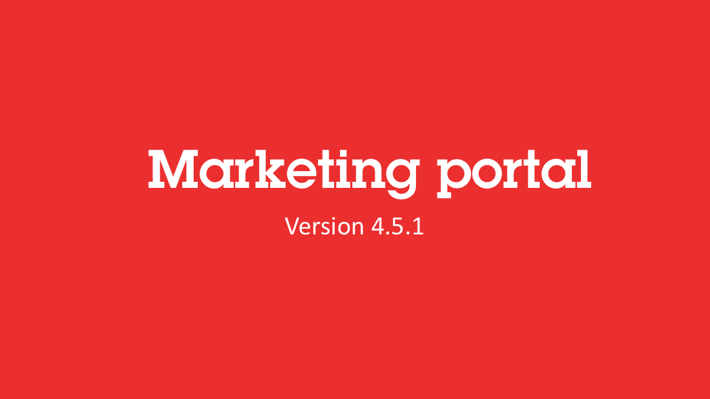
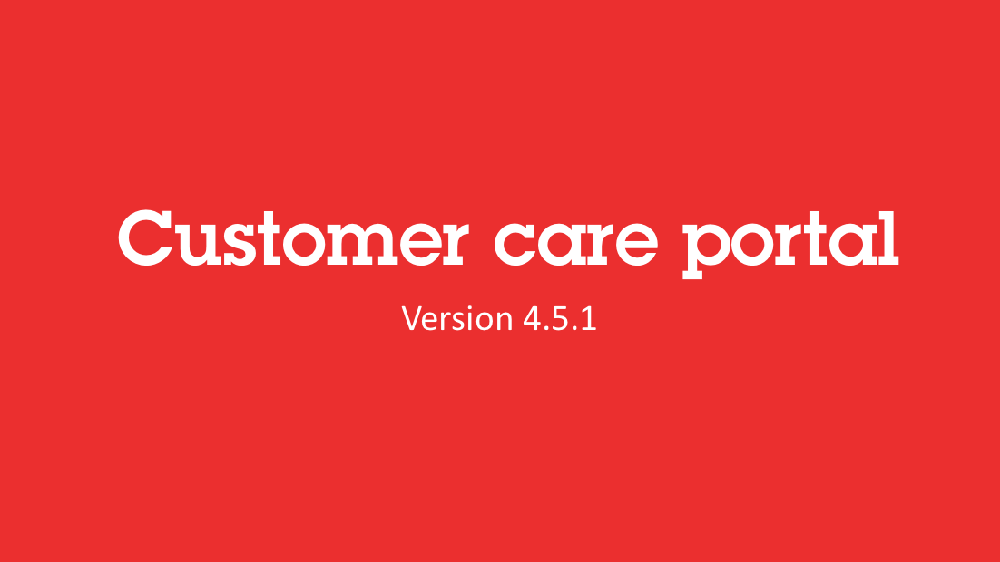
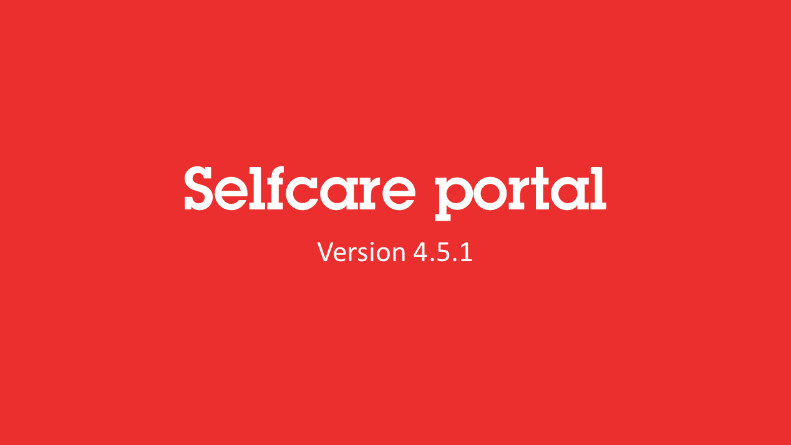

# Marketing manager portal

## Overview

The marketing UI provides sales and marketing teams with the ability to create and modify complex offers including usage, subscriptions and one-off charges.

## Video

The video below gives you a great view of the marketing manager's capabilities.  

 

## Step-by-step

1. Login into the Marketing portal with your login and password.
2. Click on offers > catalog list.
3. Click on create new offer and choose Opencell classic template.
4. Give a name and code to the offer and set status to active.
5. Select billing model and input prices.
6. Choose one-shot fee, make it mandatory and set price to $100.
7. Choose recurring flat fee, make it mandatory and set price to $10.
8. Click on Save.
1. Visualize your offer on the Catalog list

# Customer care portal

## Overview

The **customer care portal** UI provides your sales, customer service and contract admin teames with the basic capacity: 

* to manage and segment your customer base according to your organizational requirements
* to have a 360° view of a customer's activity
* to validate or amend orders and subscriptions
* to create customers 
* to generate one-off invoices
* to process payment remittances

## Video

The video below gives you a great view of our customer service capabilities. 

 

## Step-by-step tutorial

To complete.

# Selfcare portal

## Overview

The selfcare UI helps you enable your B2C and B2B clients to take care of themselves. Build using ReactJS technology, it can be customized to meet your business context and brand requirements. 

## Video

The video below gives you a great view of our self-care capabilities. 

 

## Step-by-step

To complete.
