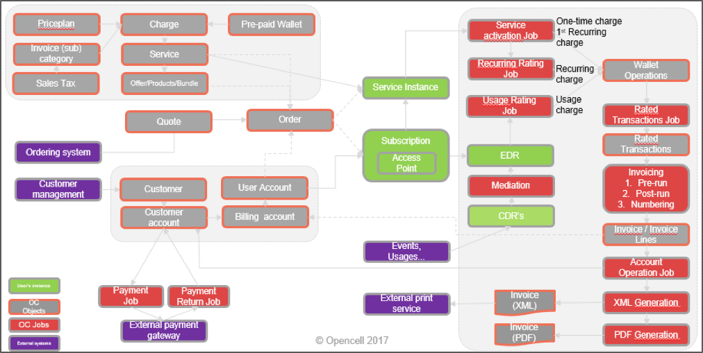
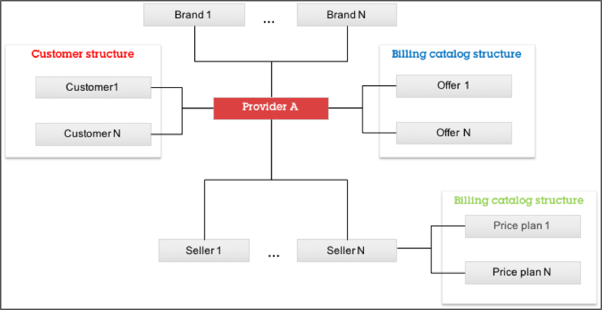
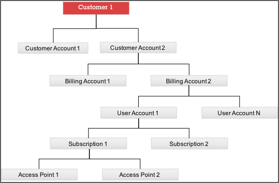
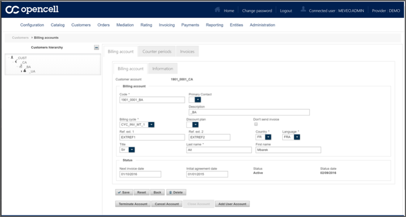
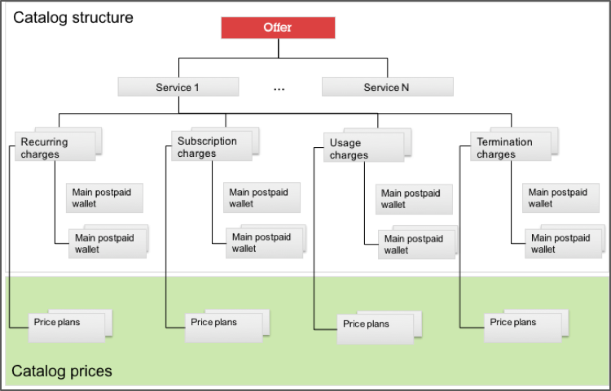
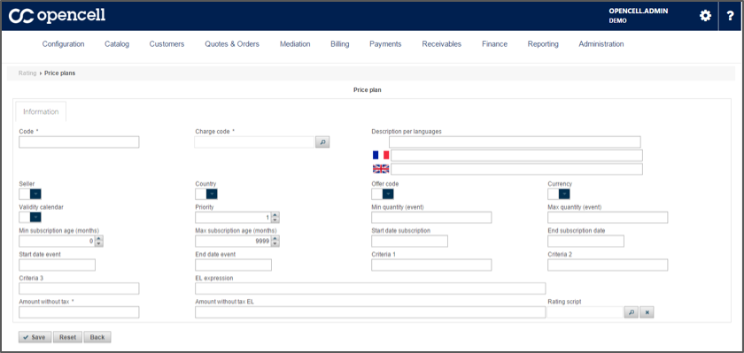

# Data model

Opencell distinguishes itself by its powerful and mature data model that allows it to adapt to almost any type of business requirement. Our framework enables us to model the most complex business scenarios including complex customer hierarchies and B2B scenarios.

##Process overview

An order received is matched against customer view and offer view to provide an instantiated and dedicated copy of the offer called subscription. This subscription is attached to associated activated services.

Multiple events imported through API or mediation (mass file processing), are transformed into EDR or usage events, that are attached to the subscription.
Several jobs or processes process one-off charges, recurring charges and usage events, turning them into wallet operations. 

The rated transaction job converts wallet operations into rated transactions, eligible for invoicing. 
Once invoicing process is complete, invoice amount is transferred to customer balance through account operation job. 

*Data model*

## Provider and seller 

The provider is the fundamental entity providing and billing the service. It is the highest-level entity and contains billing system core properties including invoice number sequence, trading languages and currencies, B2B vs. B2C flag, payment methods….

As per the diagram below, a provider can have a hierarchy of sellers as well as brands:

*Provider, sellers and brands*

## Customer structure

The customer is the entity holding a contract with the provider and thus being billed by it.

*Customer structure*


The customer entity includes a complete hierarchy detailed below:

* **Customer accounts** is a customer sub-ledger entity, holding a list of account operations (payments, open items from all the billing accounts below) that holds the consolidated customer’s credit balance. Currency is one of the parameters held at the customer account level.
* **Billing accounts** contain all the invoices from the user account subscriptions below and particularly the language parameter, meaning the same customer account can be billed with multiple language configurations.
* **User accounts** carry subscriptions and wallet operations (a default wallet, called principal wallet, is used for postpaid transactions and a secondary wallet is available for prepaid transactions).
* **Subscriptions** are attached to the user account. They carry instances of catalog services and charges (through the bundling offer) that are used in the rating engine to produce rated wallet operations.
* **Access points** are the identifier allowing usage events to be attached to the subscription.

Below is a screenshot representing a customer in the Opencell user interface. The hierarchy is represented on the left and each node gives access to a set of information as well as additional objects such as invoices, wallet operations, account operations etc.:

*Customer hierarchy configuration*

## Billing catalog structure

Catalogue configuration is the key concept required to design the pricing policy of the provider. The catalog structure and catalog price hierarchy is organized as follows:

*Catalog structure*

In the Opencell data model, catalog structure and catalog prices are two distinct concepts.

### Wallets, charges, services & offers 
Opencell uses the notion of wallets, charges, services and offers to define the catalogue structure. 

#### Wallets

Wallets can only be monetary and are used to accumulate the value of the rated transactions. Each type of charge is necessarily mapped to a wallet (prepaid or postpaid) at the level of the service. 

A customer has a postpaid wallet and potentially multiple prepaid wallets. A prepaid wallet can be kept empty so the charge can be deducted from other wallets in a cascading mode.

#### Charges

Wallets accumulate charges of different natures.

**Subscription charges** and **termination charges** are **one-shot** transactions:

* Service activation (subscription) occurs when a service of an offer that has been subscribed to is activated. All subscription charges can be instantiated and automatically rated.
* Service termination occurs when an active service instance is terminated. Depending on the cause of the termination, the termination charges can be instantiated and automatically rated.
* Other types of one-shot charges exist independently of any service. They can be applied to an existing subscription and rated automatically as in case, for example, of a penalty fee for late payment.

Recurring charges are triggered based on a calendar in the following cases:

* Service activation occurs when a service with recurring charges is activated. All recurring charges are instantiated and automatically rated for the first calendar period, potentially with a prorata calculation. 
* Service termination occurs when an active service instance is terminated. Depending on the cause of the termination, recurring charges can be rated until the end of the contract or just once with a prorata calculation.
* Recurring charges can be prorated at subscription or termination and can be charged at the beginning of the cycle or at the end.

**Usage charges** are dependent on an EDR or event data record. They can be linked to counters at the level of the service to decrement a quantity prior to applying a price (e.g. a bundle of minutes).

#### Services

**Services** group charges and are often aligned to actual services such as voice, SMS, storage, etc. but not exclusively.

#### Offers

**Offers** is a list of services that can be activated at subscription. It represents the bundle of services that is closest to the commercial package.

### Price plans

**Price plans** are entity lookups performed by the rating engine to determine the price of a charge that are attached to the seller and to a given nature of charge. 

Once a charge is identified to be applied (whether it is recurring or event-based), the rating engine will determine the price plan and thus the price depending on the properties of the charge, the age of the subscription, the event, the account and the subscription and other criteria. There is a priority attached to the price plans in case multiple price plans are applicable for a charge.

The following screenshot, shows how to configure a price plan for a charge depending on multiple criteria:

*Price plan configuration*


# Security, access and SSO

## Users, roles and permissions

By default, users have roles and permissions stored in database, and permissions are used throughout the services and UI layers to authorize access.

A permission entity consists in a permission action (read, update, delete…) and a resource (invoice, account…).
The association between users and permission is not done directly at the user level but through a list of roles that are themselves a list of permissions. 

A user is characterized by a unique username (unique among all providers), a password, a list of roles and a list of providers. When logged in, a user associated with several providers will be prompted to choose one provider in his web session.

## Identity and access management

Opencell uses Keycloak, an open source identity and access management solution that is part of Wildly, to provide SSO and identity brokering. 

Opencell uses Keycloak to provide:
* Single-sign-on 
* Identity brokering and social login
* User federation
* Standard protocols (Oauth2, SAML, OpenID)
* Authorization services
* Multi-LDAP integration

# Providers and multi-tenancy

Opencell is multi-tenant physically. Each tenant running a schema and instance in a JBOSS or on another image (VM, Docker…) is physically separated from all other tenants present on the Opencell instance. 

Providers are entities selling services to their customers, potentially through a network of resellers. Since all entities in Opencell, from catalog to accounts, are associated to a unique provider, the same JBOSS instance can host multiple Opencell instance with their providers: their data will be completely separated from the data of the other providers.

# API management and integration

## API

Opencell APIs are secured using HTTP basic authentication filter.

SOAP and REST APIs are provided for the following objects and functions:

* Catalog
* Accounts
* Quotes
* Orders
* Workflows
* Rating
* Invoicing
* Settings
* Mediation
* Dunning
* Payment

Opencell provides also TM Forum compliant APIs for the following functions :

* Catalog
* Product Order
* Product Ordering

## Other integration tools

Opencell provides additional tools such as :

* Webhooks
* XML import
* Notifications

# Software foundations

## Development language

### Back-end developemnt

Back-end is fully developped in Java EE 8 and runs on Wildfly middleware including Infinispan, ActivMQ and Keycloak.

### Front-end development

Front-end is developed using JavaScript React. This currently covers the customer care and selfcare modules but all GUI is expected to be developed using React. 

## Third party software

Like many open source software companies, Opencell relies significantly on proven third-party components.  

These include technologies such as:

* Java Enterprise Edition 8 and JavaServer Faces (JSF)
* Primefaces (Apache 2.0)
* Joda Time (Apache 2.0)
* Jackson 2.1.4 (Apache 2.0)
* Xalan 2.7 (Apache 2.0)
* Jasper Reports library (LGPL)

