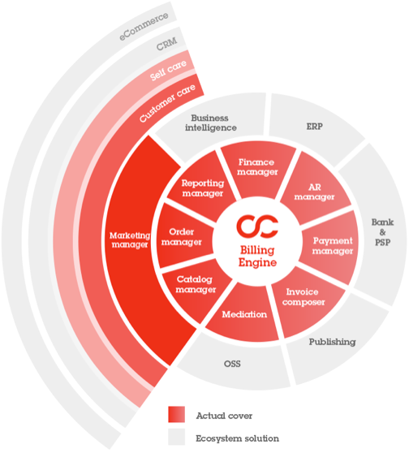
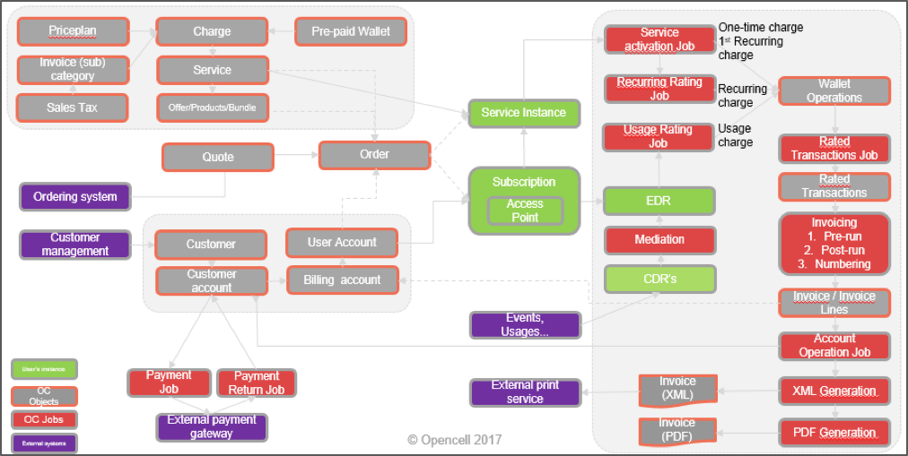

# Functional overview

Opencell’s nucleus is a powerful and flexible rating, charging and billing engine capable of rating high volume/complex usage, recurring or one-off transactions, of charging rated transactions to postpaid or prepaid wallets in real-time and managing high volume billing runs.

## Billing engine

Opencell’s core billing engine covers rating, charging, and invoicing processes.

### Rating 

The rating engine computes the charge for any event occurring in a customer account. 

Three central jobs execute the rating process:

* Activation and termination subscription jobs for one-shot events rating
* Recurring job for recurring event rating
* Usage rating job for EDR processing and generation of wallet operations

The rating process processes all EDRs and their identified charge. It selects the highest priority price plan that is compatible with the EDR, account, provider and seller context. Once the appropriate price plan is identified, the price is applied
By an exception process, it is possible to define a charge as “editable”. In this case, the “editable” price is substituted to that determined by the automatic rating process.

### Charging 

Charging describes the process whereby rated transactions are stored in temporary wallets.
 
### Wallet operations

Wallet operations are the result of the rating process. They have a unit and total price (without tax, with tax, and tax amount), a currency, an optional counter as well as start and end dates. Each wallet operation is attached to a user account wallet (either the principal postpaid wallet by default or to a prepaid wallet). 

Wallets are monetary accounts defined at the catalog level. They can either be prepaid or postpaid. A user account has a mandatory postpaid wallet, but it might be not used if the charges of the subscription point all to prepaid wallets.

### Postpaid and prepaid charging

Prepaid charging requires the ability to verify balance availability quasi-instantaneously before making the service available. To achieve this, Opencell uses a notion of reservation capability (quota or non-quota based) so that a portion of a wallet is reserved in real time. 

The association between the charges and wallets governing the charging process is done at the level of the service where each charge is associated to a list of prepaid wallets. Once a charge has a price, the charging process decrements the first wallet. If there the balance of funds available on the first wallet is insufficient, other available wallets are decremented. Ultimately, if the balance is still insufficient, the postpaid wallet is used.

An alert can be associated with prepaid wallet when it is fully depleted.

A customer that subscribes to services with multiple wallets automatically has all wallets attached to his or her user account so that wallet operations can be displayed for each wallet.

This charging process allows maximum flexibility since a separate wallet can be defined for each service (wallet SMS, voice, data).

### Rerating

Rerating functionality is available by replaying some wallet operations against a changed version of the price plan that was used to rate it.

### Billing & invoicing 

The billing process is comprised of several jobs that compute the invoice (with validation processes in between each job occurrence).

#### Rated Transactions Generation

Rated transactions are wallet operations associated with a bill run that result from the invoicing process. Since not all wallets are necessarily postpaid, rated transactions must be generated from wallet operations before invoicing. A rated transaction job performs this task.

#### Bill Run Creation

After rated transactions are generated, the invoicing process can be executed using two options:

* Global invoicing: This batch mode processes all billing accounts attached to a billing cycle. It is possible to select invoices by date range and choose a long or short invoicing process (with or without post invoicing report).
* Exceptional invoicing: This mode makes it possible to process specific billing accounts by selecting them manually.

Launching the billing process creates a bill run entity that contains the list of billing accounts to be invoiced and has a status representing the state of the invoicing process. Invoicing jobs can be run multiple times to generate a pre-invoice report with an aggregate view of the future result of the invoicing or a post-invoice report with a list of billing accounts and total invoiced amounts. 

During this preparation process, a billing account can be excluded if an anomaly is detected so that it can be managed in a separate dedicated bill run.
Each invoicing report can either be accepted or cancelled. After validation of the last report, the invoicing job processes the bill run and assigns an invoice number for each invoice and updates the next invoice date of the invoiced billing accounts.
Below is a screenshot that shows the step-by-step bill run management process :

Figure 59 : Bill run management screenshot

#### Invoice generation

An invoice is generally the result of a billing run. The invoice entity is generated from rated transactions and contains the following information:

* Invoice number
* Invoice date
* Due date
* Payment method
* Amount without tax 
* Tax amount
* Amount with tax
* Net to pay

It also contains aggregates that cumulate amount per category/sub-category. A sub-category regroups charges that, at a minimum, share the same tax rate and G/L accounting code.

The XML invoice creator job produces XML invoice in the file system for each invoice in database.  This XML format can then be used to export to third-party systems or be used as a base to generate PDF invoices that can be stored in Opencell.

#### Credit notes
A credit note job can be used to issue credit notes if an error occurred in the billing cycle or  an invoice correction is required for commercial reasons.

When issuing the credit note, it is possible to choose to adjust the original invoice either at the aggregate level (invoice categories) or at line item level (rated transactions).
 
##Other core modules
 
Surrounding the nucleus are a first series of core modules providing additional functionalities on an as-needed basis:

* **Marketing manager** provides capacity to manage products, bundles and offers from a functional point of view, define validation workflow processes and Customer care organization 
* **Reporting manager** includes a data warehouse with all relevant data for creating subscription-specific finance, marketing and operations reporting.
* **Order manager** orchestrates the ordering process with the overall enterprise process for validating and provisioning of external systems and managing subscription lifecycle.
* **Catalog manager** provides business analysts the ability to easily create and manage complex offers and expose them to CRMs, self-service portals and e-commerce systems. 
* **Finance manager** enables finance teams to manage subscription-specific revenue recognition rules, chart of accounts G/L mapping and close periods.
* **AR manager** provides ability to apply cash received through batch processes, manage open balances and automate dunning processes per pre-defined rules. 
* **Payment manager** provides an interface with multiple payment and remittance gateways
* **Invoice composer** is used to compose invoices in PDF or paper format.
* **Mediation manager** is used to clean and aggregate multiple sources of transactional data using standard telco Diameter protocol.

## Portals

In order to accelerate business implementation and reduce costs, we provide two portals that can be used to tailor your UX to business requirements:

* Our **customer care portal** provides the building blocks to manage your customers from your organizational point of view, validate or amend orders, create customers and manage your full 360° customer view.
* **Our selfcare portal** enables customers to register, subscribe to an offer, manage their contracts, see their usage, bills and subscribe to new options…

## Third-party connectors

Finally, in its outer core, Opencell provides extensive connectors to third-party systems including that can also be used to accelerate the integration process:

* CRM and e-commerce solutions such as Salesforce or Dynamics CRM or Magento,
* Business intelligence packages such as PowerBI, Qlikview, Jasper Reports or Pentaho, 
* ERP solutions such as Dynamics NAV, SAP, Sage or Odoo, 
* Payment gateways such as Ingenico, Braintree, Stripe or Slimpay
* Invoice composition tools such as Jasper Reports
* Telco-grade operating system solutions (OSS) such as Metaswitch.

# Data model

Opencell distinguishes itself by its powerful and mature data model that allows it to adapt to almost any type of business requirement. Our framework enables us to model the most complex business scenarios including complex customer hierarchies and B2B scenarios.

##Process overview

An order received is matched against customer view and offer view to provide an instantiated and dedicated copy of the offer called subscription. This subscription is attached to associated activated services.

Multiple events imported through API or mediation (mass file processing), are transformed into EDR or usage events, that are attached to the subscription.
Several jobs or processes process one-off charges, recurring charges and usage events, turning them into wallet operations. 

The rated transaction job converts wallet operations into rated transactions, eligible for invoicing. 
Once invoicing process is complete, invoice amount is transferred to customer balance through account operation job. 

*Data model*

## Provider and seller 

The provider is the fundamental entity providing and billing the service. It is the highest-level entity and contains billing system core properties including invoice number sequence, trading languages and currencies, B2B vs. B2C flag, payment methods….
As per the diagram below, a provider can have a hierarchy of sellers as well as brands:
 


