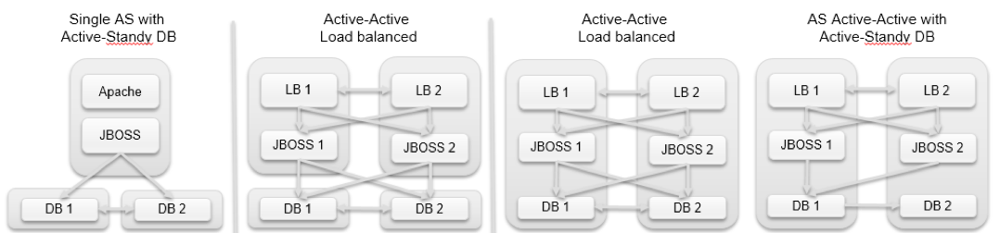

# Installation requirements

## Operating system 

Opencell runs on any OS platform provided a Java virtual machine version 8 is supported.

Here are examples of operating systems generally used:

* Linux Debian
* Linux Redhat
* Linux CentOS
* Linux Ubuntu

For more recommendations regarding supported configuration, refer to RedHat JBoss Enterprise Application Platform (EAP) 7 Supported Configurations [https://access.redhat.com/articles/2026253]()

## Database 

Here is a non-exhaustive list of supported databases:

* MySQL 5.5 5.6 or above
* MariaDB 10.1 or above
* MariaDB 10.1 with Galera 25.3
* PostgreSQL 9.2 or above
* H2 1.4 or above
* Oracle 11g R2, 11g R2 RAC
* DB2 9.7 or above
* Microsoft SQL Server 2012 SP3
* Sybase ASE 15.7 (jConnect 7.0)

## Middleware

Firefly xxxx

#Dimensioning, performance and scalability

The dimensioning of the platform depends on different functional criteria (catalog dimension, amount of customer, CDRs, invoices, PDF complexity and volume, etc.).

Utilities such as Datagrid (infinispan), ActivMQ, NoSQL stores (MongoDB) or clustering can be used to increase Opencell performance and scalability.

##Cache

Several cache technologies are used to speed up treatments and enhance scalability.

Account and subscription import use Hibernate second level cache to avoid successive queries to the database for data that is used repeatedly (for example, trading currencies, countries, tax of a provider…).

When performing mediation and usage rating, an in-memory replicable data grid (Infinispan) is used to cache the subscriptions and the counters. This cache is flushed in datastore after heavy processes are finished.

##NoSQL stores

For most entities storage in relational database is well adapted, as foreign keys are heavily used to ensure coherence of catalog and accounts.

In the event of high level of transactions (>100 000k invoices per month) or significant levels of usage events (> 10 000 000m events), it is beneficial to store CDRs, EDRs, wallet operations, rated transactions and invoices in NoSQL stores with fast read access like MongoDB.

Similarly, using Hadoop tasks to perform invoicing can drastically increase performance of mediation, rating and invoicing.

#Multi-node configuration 

Opencell can be run on parallel servers using out-of-the box functionalities provided by JBOSS.

Example of deployments patterns for a two-node configuration (not exhaustive) are provided below:

*Possible deployment configurations*



In addition, usage of master-slave or active-standby database configuration or cloud punctual VM scale up can help manage the expected configuration for the load.

Some other uses cases show integration of Opencell as a microservice for invoicing.

##Clustering

Some functions can be run on parallel servers (such as mediation…) servers using the out-of-the box clustering functionalities provided by the Infinispan distributed data-grid and ActivMQ for job notification.
 
Nodes dedication to some jobs can be achieved within the cluster.

#Deployment options

## On premise
Opencell can be deployed on customer premise based on the technical requirements listed above. 

##Online option
Opencell is also accessible for online PaaS or IaaS deployment on the Azure or Oracle cloud marketplaces. More generally, it can be deployed on any cloud provider hosting Java, JBOSS or Docker.



