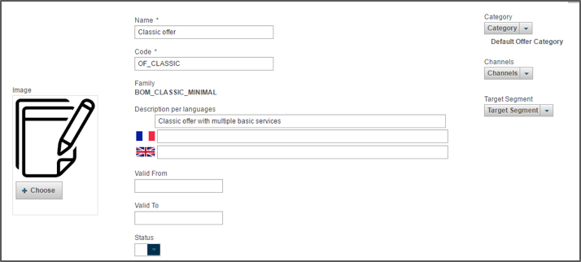

# Introduction

The marketing UI provides marketing teams with the capacity to manage products, bundles and offers from a functional point of view as well as define validation workflow processes and customer care organization.

The marketing manager menu is organized into four tabs:

* home page
* offers
* products
* order workflow

# Quick start
The video below gives you a great view on all the sweet goodness of the marketing manager :)

# Deep dive
 
Ready to find out more? Let's walk you through the screens. 

## Home page

After logging in, you are presented with a dashboard including calculation and display of key performance indicators based on Opencell data warehouse information (churn and MRR) as order validation workflow. 

## Offers

All available offers included in the catalog can be displayed. They can be filtered by publication status (active, retired, in design…) and be associated with a given publication period. 

Through this interface, it is possible to create a new offer, export part of the catalog as well as view, edit or create a new version of an existing offers.

*Catalog view*

The offer catalog provides the possibility to create offers based on any business models. After designing and validating an offer through a pre-defined workflow, the offer can be exported to a new environment such as pre-production or production.

An offer is defined by name, code and description. It is possible, using simple configuration, to add offers to multiple categories, channels or target customer segments.

*Offer configuration*

Physical products, defined in the product section, can easily be bundled into the overall offer:

*Offer configuration*

Depending on your model, you can define a variety of services: 

*Mandatory one-off fee*

*Recurring flat fee with partner settlement*

*Simple usage-based pricing*


*Usage-based pricing based on volume*

Promotional elements can also be configured:

*Discount configuration with engagement period*

Frequency of the recurring charge is also configurable:

*Definition of recurring service period*

## Products

The catalog lists all available products. They can be filtered by publication status (active, retired, in design…) and have a defined publication period. 

Using the product catalog, it is possible to create a new product or bundle, export part of the catalog, or view, edit or clone existing products.

*Product catalog list view*

When creating a new product, name, code, and elements of categorization (category, channels, segments) can be set in multiple languages. A publication period (associated with a publication status) as well as a sales price and catalog price can also be defined. 

*Create new catalog item*

## Order workflow

Customer care users can choose to validate all incoming orders before turning them into subscriptions.

A demonstration workflow is provided below to show the possibilities to define rules and assign the orders to some teams based on multi criteria. The default screen shows a “catch all” rule by default:

*Order workflow - catch all rule*


Using this screen, it is possible to define a rule. Each rule has a name, associated criteria, and a target team assignation. Workflow criteria can include sales amount (with dynamically defined range), a territory or an account type. The model is extendable. 

Target team assignation is based on user groups as defined in the my company tab.

*Workflow rule configuration*


Once the rule creation is finished, it is displayed in the list. Rule evaluation order can be changed using the arrows.

*Sample rule result*




